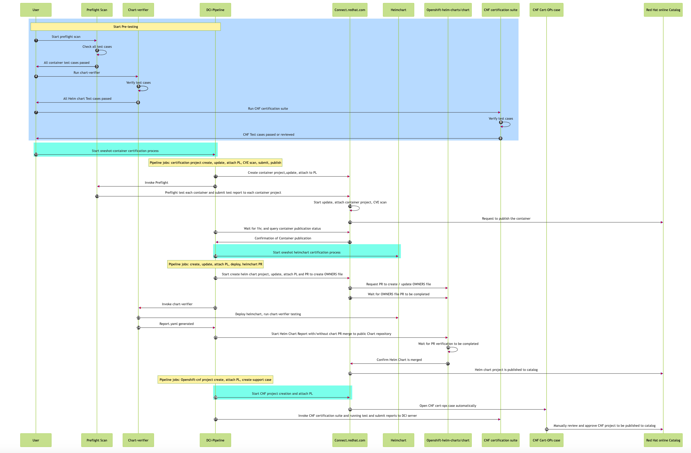

# CNF Oneshot Automation Flow


## cnf-certification-one-shot-automation
This repo purpose is to automate the partners CNF certification that have been done the sanity checking for following steps:
- Using Preflight script or manual to perform sanity checking and all these test cases that preflight is testing and `it Must be passed!` and `its verdict passed` also.  
**Main Test Case must pass as follow:**
```shellSession
======================================================
Image Name           Test Case                 Status    
------------------------------------------------------
universal-smf-ava   HasLicense                PASSED    
universal-smf-ava   HasUniqueTag              PASSED    
universal-smf-ava   LayerCountAcceptable      PASSED    
universal-smf-ava   HasNoProhibitedPackages   PASSED    
universal-smf-ava   HasRequiredLabel          PASSED    
universal-smf-ava   RunAsNonRoot              PASSED    
universal-smf-ava   HasModifiedFiles          PASSED    
universal-smf-ava   BasedOnUbi                PASSED    
Verdict: PASSED
```
For details of sanity check script using preflight scan, it can be found [here](https://github.com/ansvu/quick_scan_container_images_online_offline)

<details>
<summary>Preflight All Test Cases</summary>

```shellSession
  
[Container Policy]: invoked on container images
- HasLicense
- HasUniqueTag
- LayerCountAcceptable
- HasNoProhibitedPackages
- HasRequiredLabel
- RunAsNonRoot
- HasModifiedFiles
- BasedOnUbi

[Container Root Exception Policy]: automatically applied for container images if preflight determines a root exception flag has been added to your Red Hat Connect project
- HasLicense
- HasUniqueTag
- LayerCountAcceptable
- HasNoProhibitedPackages
- HasRequiredLabel
- HasModifiedFiles
- BasedOnUbi

[Container Scratch Exception Policy]: automatically applied for container checks if preflight determines a scratch exception flag has been added to your Red Hat Connect project
- HasLicense
- HasUniqueTag
- LayerCountAcceptable
- HasRequiredLabel
- RunAsNonRoot
```

</details>

- Using chart-verifier either use dci to run or manually to generate report.yaml
<details>
<summary>Chart Verifier Test Checking</summary>

```shellSession
    - check: v1.0/chart-testing
      type: Mandatory
      outcome: PASS
      reason: Chart tests have passed
    - check: v1.0/has-readme
      type: Mandatory
      outcome: PASS
      reason: Chart has a README
    - check: v1.0/not-contains-crds
      type: Mandatory
      outcome: PASS
      reason: Chart does not contain CRDs
    - check: v1.0/signature-is-valid
      type: Mandatory
      outcome: SKIPPED
      reason: 'Chart is not signed : Signature verification not required'
    - check: v1.0/helm-lint
      type: Mandatory
      outcome: PASS
      reason: Helm lint successful
    - check: v1.1/images-are-certified
      type: Mandatory
      outcome: PASS
      reason: 'Image is Red Hat certified : quay.io/avu0/oneshot-demo2-nginx-ubi9:1-22'
    - check: v1.0/not-contain-csi-objects
      type: Mandatory
      outcome: PASS
      reason: CSI objects do not exist
    - check: v1.0/required-annotations-present
      type: Mandatory
      outcome: PASS
      reason: All required annotations present
    - check: v1.0/contains-test
      type: Mandatory
      outcome: PASS
      reason: Chart test files exist
    - check: v1.0/contains-values-schema
      type: Mandatory
      outcome: PASS
      reason: Values schema file exist
    - check: v1.0/is-helm-v3
      type: Mandatory
      outcome: PASS
      reason: API version is V2, used in Helm 3
    - check: v1.0/contains-values
      type: Mandatory
      outcome: PASS
      reason: Values file exist
    - check: v1.1/has-kubeversion
      type: Mandatory
      outcome: PASS
      reason: Kubernetes version specified
```
</details>

For more details of `chart-verifier` test cases, please click [chart-verifier-test-cases-details](https://github.com/redhat-certification/chart-verifier/blob/main/docs/helm-chart-checks.md)

## Prerequisites

- [DCI](https://blog.distributed-ci.io/introduction-to-the-red-hat-distributed-ci.html) is Red Hat Distributed CI, written in Ansible.
- [Preflight](https://github.com/redhat-openshift-ecosystem/openshift-preflight) is a command-line interface for validating if OpenShift operator bundles and containers meet minimum requirements for Red Hat OpenShift Certification.
- Set up a jumphost with internet access, install the dci-openshift-appagent, detailed guide can be found in this link [dci-openshift-app-agent-install](https://doc.distributed-ci.io/dci-openshift-app-agent/)
- Install dci-pipeline  
  [DCI-PIPELINE](https://github.com/redhat-cip/dci-pipeline) 
- It is recommended consistently check latest version of the DCI app agent package, and upgrade to latest version before using.
```bash
$ sudo dnf upgrade --refresh --repo dci -y
```
- DCI Control server credential
  [create remote-ci credentials](https://www.distributed-ci.io/remotecis)
  Click on `credentials.yaml` then save contents to a path where `su - dci-openshift-app-agent` user is or you can save any path you legit. 
  This file will be used by the dci-pipeline parameter `dci_credentials: /etc/dci-pipeline/dci_credentials.yml`
- Again container images sanity check with preflight and CNF helmchart `report.yaml` must be green and passed all the tests before `one-shot-cnf-certification-automation` to work
- Create github token to be used for helmchart PR  
  `github_token_path: "/opt/cache/dcicertbot-token.txt"`  
  [how-to-create-github-token](https://github.com/redhatci/ansible-collection-redhatci-ocp/blob/main/roles/create_certification_project/README.md#github-token)
- Create Pyxis Apikey    
A token to access specific partner Pyxis catalog data using REST API. [Create Pyxis API Key](https://connect.redhat.com/account/api-keys) 
- Kubeconfig   
A kubeconfig that can access the OCP cluster 
- Product-listing ID  
Before a container or helm chart/operator can be publicly listed into RedHat catalog, a Product-Listing must be created, it only need to create once according to CNF type.
Follow this link to [Create-Product-Listing](https://connect.redhat.com/manage/products)  
- Organization ID  
Mandatory when using create_container_project. Company ID will be used for the verification of container certification project Organization-ID Company-Profile.


## Prepare DCI Pipeline Oneshot Container
This `DCI Pipeline` Setting will include `create container certification project`, update mandatory parameters, scan container+submit the results and attach the product-listing to newly created project. 

**pipelines/oneshot-container-pipeline.yml:**
```yaml
---
- name: oneshot-container
  stage: container
  prev_stages: [ocp-upgrade, ocp]
  topic: OCP-4.14
  ansible_playbook: /usr/share/dci-openshift-app-agent/dci-openshift-app-agent.yml
  ansible_cfg: ~/avu-dci-pipeline-test/pipelines/ansible.cfg
  ansible_inventory: ~/avu-dci-pipeline-test/inventories/@QUEUE/@RESOURCE-workload.yml
  dci_credentials: ~/.config/dci-pipeline/dci_credentials.yml
  ansible_extravars:
    dci_cache_dir: ~/dci-cache-dir
    dci_config_dir: ~/avu-dci-pipeline-test/ocp-workload
    dci_gits_to_components:
      - ~/avu-dci-pipeline-test
    dci_local_log_dir: ~/upload-errors
    dci_tags: ["oneshot", "preflight", "step1"]
    dci_workarounds: []

    organization_id: 15451045
    page_size: 200
    
    # docker auth and backend access
    partner_creds: "/var/lib/dci-openshift-app-agent/demo-auth.json"
    pyxis_apikey_path: "/var/lib/dci-openshift-app-agent/demo-pyxis-apikey.txt"
    
    # reduce the job duration
    do_must_gather: false
    check_workload_api: false

    # run preflight check container tests,
    # create cert project, and submit tests results
    preflight_containers_to_certify:
      - container_image: "quay.io/avu0/oneshot-demo2-nginx-ubi9:1-22"
        create_container_project: true
        short_description: "I am doing a full-automation e2e auto-publish for following image oneshot-demo2-nginx-ubi9"
        pyxis_product_lists:
          - "6397a9d2aea4e1694b0fe1c4"

    # update the cert project for container
    cert_settings:
      # container
      auto_publish: true
      build_categories: "Standalone image"
      registry_override_instruct: "These are instructions of how to override settings"
      email_address: "email@example.com"
      application_categories: "Networking"
      os_content_type: "Red Hat Universal Base Image (UBI)"
      privileged: false
      release_category: "Generally Available"
      repository_description: "This is a test repository for one-shot automaiton"

  use_previous_topic: true
  inputs:
    kubeconfig: kubeconfig_path
...
```
## Prepare DCI Pipeline Oneshot Helmchart
This `DCI Pipeline` Setting will include `create helmchart certification project`, update mandatory parameters, and attach the product-listing to newly created project. 

**dci-pipeline-settings-helmchart-e2e-cert-chartverifier-pr.yaml:**
```yaml
---
- name: oneshot-helmchart
  stage: workload
  prev_stages: container
  topic: OCP-4.14
  ansible_playbook: /usr/share/dci-openshift-app-agent/dci-openshift-app-agent.yml
  ansible_cfg: ~/avu-dci-pipeline-test/pipelines/ansible.cfg
  ansible_skip_tags:
    - hook-post-run
  ansible_inventory: ~/avu-dci-pipeline-test/inventories/@QUEUE/@RESOURCE-workload.yml
  dci_credentials: ~/.config/dci-pipeline/dci_credentials.yml
  ansible_extravars:
    dci_cache_dir: ~/dci-cache-dir
    dci_config_dir: ~/avu-dci-pipeline-test/ocp-workload
    dci_gits_to_components:
      - ~/avu-dci-pipeline-test
    dci_local_log_dir: ~/upload-errors
    dci_tags: ["oneshot", "helmchart", "helmchart-pr", "step2"]
    dci_workarounds: []
  
    # docker auth and backend access
    partner_creds: "/var/lib/dci-openshift-app-agent/demo-auth.json"
    pyxis_apikey_path: "/var/lib/dci-openshift-app-agent/demo-pyxis-apikey.txt"

    organization_id: 15451045
    page_size: 200
    
    # reduce the job duration
    do_must_gather: false
    check_workload_api: false

    # run helmchart tests and generate report.yaml
    do_chart_verifier: true
    partner_name: "redhat-arkady-test"
    partner_email: "redhat-arkady-test@redhat.com"
    github_token_path: "/var/lib/dci-openshift-app-agent/github-token.txt"
    #sandbox_repository: "ansvu/charts"

    # create helmchart cert project at connect
    helmchart_to_certify:
      - repository: "https://github.com/ansvu/yingoneshotchart"
        short_description: "This is a test for one shot automation together with container+chart+helmchart-pr"
        chart_name: "yingoneshotchart"
        create_helmchart_project: true
        pyxis_product_lists:
          - "6397a9d2aea4e1694b0fe1c4"

    dci_charts:
      - name: yingoneshotchart
        chart_file: https://ansvu.github.io/yingoneshotchart/yingoneshotchart-0.1.5.tgz
        deploy_chart: true
        flags: "-W --helm-install-timeout 5m0s"
        create_pr: true

    # update the cert project for helm chart
    cert_settings:
      # helmchart
      email_address: "avu@redhat.com"
      application_categories: "Networking"
      github_usernames: "ansvu"
      long_description: "This is a long 100+ characters description about this sample chart"
      distribution_method: "undistributed"
      distribution_instructions: "Instruction how to get this helm-chart"

  use_previous_topic: true
  inputs:
    kubeconfig: kubeconfig_path
...
```

## Prepare DCI Pipeline Openshift-cnf E2E Certification Setting
This `DCI Pipeline` Setting will include `create Openshift-cnf certification project` and attach the product-listing to newly created project. Once this `vendor validated` project is created, then the support-case also created automatically. To finalize the `Vendor-valiated` certification, it needs the Backend or someone who access to saleforce BE to approve it.  

**dci-pipeline-settings-openshift-cnf-e2e-cert.yaml:**
```yaml
---
- name: Openshift-CNF-Project-Creation Using Pipeline
  stage: openshiftcnf
  prev_stages: helmchartpr
  ansible_playbook: /usr/share/dci-openshift-app-agent/dci-openshift-app-agent.yml
  ansible_cfg: /usr/share/dci-openshift-app-agent/ansible.cfg
  ansible_inventory: /etc/dci-openshift-app-agent/hosts.yml
  dci_credentials: /etc/dci-pipeline/dci_credentials.yml
  topic: OCP-4.13
  ansible_extravars:
    dci_name: create openshift-cnf project using DCI Pipeline
    dci_configuration: Using DCI Pipeline to create openshift-cnf project  
    dci_tags: ["debug", "openshift-cnf"]
    dci_cache_dir: /var/lib/dci-pipeline
    dci_config_dirs: [/etc/dci-openshift-agent]
    dci_workarounds: []
    partner_creds: "/var/lib/dci-openshift-app-agent/demo-auth.json"
    check_for_existing_projects: true
    organization_id: 11111111
    do_must_gather: false
    check_workload_api: false
    page_size: 400
    pyxis_apikey_path: "/var/lib/dci-openshift-app-agent/demo-pyxis-apikey.txt"
    cnf_to_certify:
      - cnf_name: "DemoCNF23.8 on OCP4.14"
        create_cnf_project: true

    cert_listings:
      email_address: "me@redhat.com"
      published: true
      type: "container stack"
      pyxis_product_list_identifier: "22222222222222222222222"
      attach_product_listing: true

  components: []
  inputs:
    kubeconfig: /var/lib/dci-openshift-app-agent/kubeconfig
```

## How To Run One Shot CNF Certification Automation
```shellSession
$ dci-pipeline dci-pipeline-settings-helmchart-e2e-cert-chartverifier-pr.yaml dci-pipeline-settings-helmchart-e2e-cert-chartverifier-pr.yaml dci-pipeline-settings-openshift-cnf-e2e-cert.yaml
```
